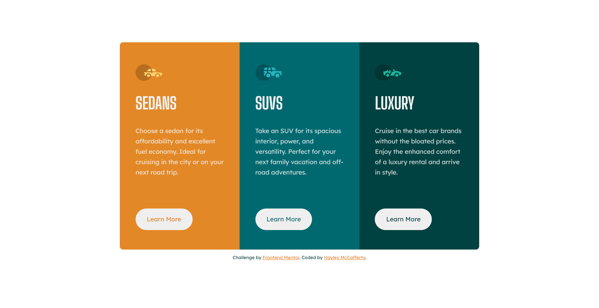

# 3 Column Preview Card Component

Challenge from [Frontend Mentor](https://www.frontendmentor.io/)

## Usage

The purpose of this project was to practice HTML and CSS skills with a design
from Frontend Mentor challenge

## Challenge Description

"This challenge is perfect if you're just getting started. The shift between the
layouts will be a nice test if you're new to building responsive projects."

## Tech Stack

**Client:** HTML, CSS

## Authors

- [@haylzrandom - GitHub](https://www.github.com/haylzrandom)
- [@haylzrandom - Frontend Mentor](https://www.frontendmentor.io/profile/HaylzRandom)

## Acknowledgements

- [3-Column Preview Card Component](https://www.frontendmentor.io/challenges/3column-preview-card-component-pH92eAR2-)

## Related

Here are some related projects

- [Order Summary Component](https://github.com/HaylzRandom/order-summary-component)
- [QR Code Component](https://github.com/HaylzRandom/qr-code-component)
- [NFT Preview Card Component](https://github.com/HaylzRandom/nft-preview-card-component)
- [Stats Preview Component](https://github.com/HaylzRandom/stats-preview-card-component)

## Screenshots

Desktop Screenshot

Mobile Screenshot

